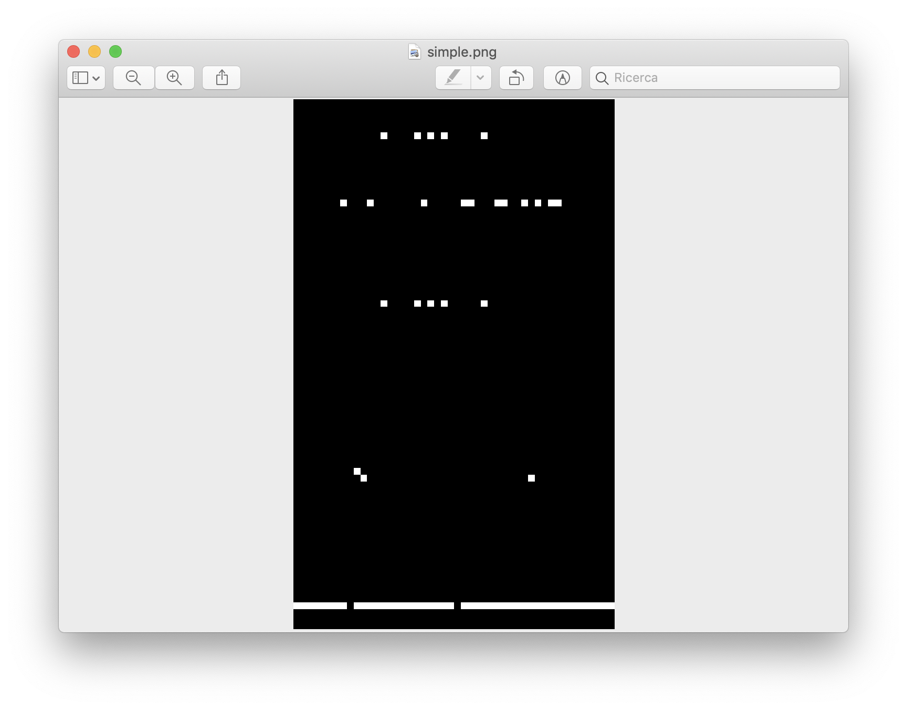

# dataset_creator
La cartella `dataset_creator` contiene lo script **dataset_creator.py** che utilizza lo script **ms2raster.py** per generare file di testo con matrici di zeri e uni e li converte in immagini `.png` usando il modulo **matrix_to_image.py**. Per la generazione delle matrici sottoforma di file di testo si usa **ms2raster.py** che a sua volta usa un output modificato di **ms** e **mssel**. Oltre a questi script principali sono presenti anche tutti i moduli per il corretto funzionamento.

## dataset_creator.py
Per prima cosa si ricava il path della cartella di esecuzione che servirà per muoversi all'interno di tutte le cartelle che verranno generate in seguito e per il corretto funzionamento di **ms2raster.py** che richiede il path corrente come input. Vengono poi chiesti tutti i parametri in input:
* Quale dataset creare tra `SELECTION [S]`, `NEUTRAL [N]` o entrambi `[B]`;
* Grandezza delle singole matrici (-bp);
* Numero di matrici da generare rispettivamente per il `TRAINING SET`, `VALIDATION SET` e per il `TEST SET`;
* Intensità di selezione;
* Se trasformare o meno il dataset in immagini;
* Se tenere le cartelle contenti le matrici in formato testuale;
* Se comprimere il dataset creato ed eventualmente il nome dell'archivio.

Prima di cominciare a generare le matrici preparo i file per la creazione dei dataset e la struttura di cartelle che andrà ad ospitare i vari dataset divisi per tipo. Per farlo uso la funzione **create_tree()** contenuta nel modulo **foldertreemng.py** che in caso non ci fosse nessuna struttura di cartelle presente ne crea una mentre se trova residui di esecuzioni precedenti le elimina per ricreare la struttura necessaria con cartelle con all'interno solo i file necessari.
Una volta raccolti i parametri necessari e create le cartelle vengono eseguiti i comandi con le giuste combinazioni di comandi a seconda dei parametri inseriti.
Una volta creato il set di matrici in formato `*.sim`, se si ha deciso di trasformarlo in immagini `*.png` vengono create le rispettive cartelle e viene usata la funzione **converter_fn()** contenuta nel modulo **matrix_to_image_fn.py** per trasformare ogni matrice in immagine.

Alla fine di tutto il processo usiamo la funzione **clean_tree()**, sempre contenuta all'interno del modulo **foldertreemng.py**, per eliminare tutti i file che non servono più o che sono presenti più volte inutilmente.

### Esempio di schermata iniziale e input:
```
Path corrente: /home/mdonato/dataset_creator/

Comando generico:
python3 ms2raster.py -bp 10000 -s 2 -l selection -selstr 0.005 -p /home/mdonato/dataset_creator/ -i 24

-bp:		lunghezza matrice
-s:		numero dimatrici da generare
-l:		modalità
-selestr:	ntensita' della selezione si puo' controllare con -selstr (quando -l e' neutral, non viene considerata)
-p:		path della cartella contenente i moduli necessari
-i:	        numero di individui da considerare

Avviare in modalità SELECTION[S], NEUTRAL[N] o entrambi[B]? B
Inserire grandezza singole matrici (-bp): 1000
Inserire quante matrici per il training set (-s): 300 
Inserire quante matrici per il test set (-s): 100 
Inserire un valore per selstr (-selstr): 0.005
```
Una volta avviato lo script con i parametri generati verranno creati tutti i dataset in formato di testo e alla fine verrà chiesto se si vuole convertire le matrici generate in immagini.
<p align=center><strong> ->IMPORTANTE:  I DATI VENGONO SOVRASCRITTI AD OGNI ESECUZIONE <- </strong></p>

```
Vuoi trasformare le matrici in immagini? [Y]/[N]: Y

Trasformo il selection training set in immagini...
100%|█████████████████████████████████████████████████████| 300/300 [00:10<00:00, 28.37it/s]

Trasformo il selection test set in immagini...
100%|█████████████████████████████████████████████████████| 100/100 [00:03<00:00, 26.65it/s]

Trasformo il neutral training set in immagini...
100%|█████████████████████████████████████████████████████| 300/300 [00:13<00:00, 21.53it/s]

Trasformo il neutral test set in immagini...
100%|█████████████████████████████████████████████████████| 100/100 [00:05<00:00, 19.95it/s]
```
Le matrici trasformate saranno immagini B/N di questo tipo:

Nel caso in cui si decida di trasformare il dataset appena creato in immagini verrà chiesto se si desidera tenere solo le immagini o anche il dataset originale in formato testuale. In caso di risposta negativa le cartelle contenenti i file di testo con le matrici verranno eliminati.
```
Vuoi tenere le matrici in formato testuale? [Y]/[N]: N
```
L'ultima opzione è temporanea e serve a me per scaricare comodamente il dataset da cluster e serve a creare un archivio della cartella `DATASET` che contiene il dataset appena creato. Il programma chiede anche il nome dare all'archivio in modo da poter creare più archivi senza che questi vengano sovrascritti.
```
Vuoi comprimere il dataset appena creato? [Y]/[N]: Y
Inserisci un nome da dare al file compresso: dataset_1
DATASET/
DATASET/SELECTION/
DATASET/SELECTION/TRAIN_IMG/
DATASET/SELECTION/TEST_IMG/
DATASET/NEUTRAL/
DATASET/NEUTRAL/TRAIN_IMG/
DATASET/NEUTRAL/TEST_IMG/
```
### log.txt:
Durante l'esecuzione viene creato un file `log.txt` all'interno della cartella `DATASET` che contiene tutti i parametri usati per generare le matrici e i relativi comandi per **ms** ed **mssel**.
## foldertreemng.py
Il modulo **foldertreemng.py** contiene due funzioni per la gestione dei file e delle cartelle necessari al corretto funzionamento del programma. 
* **create_tree(path, mode)** in base alla modalità selezinoata crea la cartella `DATASET` e prepara la struttura di cartelle con all'interno i file necessari per l'esecuzione di **ms2raster.py** presi dal file `ms2raster.zip` presente nella cartella principale che viene estratto in ogni ultima sottocartella creata. Inoltre, all'interno della funzione, è presente anche un controllo che elimina tutti i file e le cartelle delle vecchie esecuzioni e prepara le cartelle e i file per l'esecuzione corrente.
* **clean_tree(path, mode)** ripulisce le cartelle contenenti il dataset dai file non più necessari che erano stati estratti in precedenza da `ms2raster.zip`.

## matrix_to_image_fn.py
Contiene la funzione **converter_fn(path, file_name)** che converte le matrici generate in immagini `*.png`. Per farlo prende in input il percorso delle matrici in formato `*.sim` e il nome con cui voglio salvare queste immagini (path completo + nome del file).